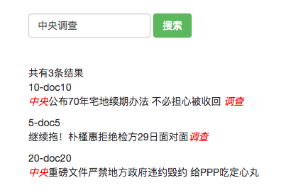

一个基于内存的搜索引擎

运行环境 
-------
- python 2.7 
- pip install jieba  
*[小白安装说明](install.md)*

 
命令行
---------
python search.py

网页
-------
1. 安装Flask (pip install Flask)
2. python api.py
3. 浏览器打开网页 http://localhost:8282/

#### 网页界面 

文档集合
----------
- docs.txt 中包含所有待检索文档
- 每一行代表一个文档
- 每一行用tab分为三列，第一列为id，第二列为文档名（不参与检索），第三列为文档内容（为检索内容）。

关键技术
-------
- 倒排索引
- 向量空间模型(VSM)
- TF-IDF
- 相似度计算
- 分词
- 点击排序/Learning to Rank: LambdaMart(todo)

运行步骤
-------
一、启动 

1. 读入所有文档docs.txt，生成 list<Doc>，动态生成分词字典
2. 对文档分词，建倒排索引。 

二、搜索 

1. 输入查询q
2. 分词。对q分词，得到term list。
3. 检索。根据每个term，从倒排索引中取出候选doc。合并得到doc list。
4. 排序。计算每个doc和q的相似度。
5. 返回。给出最相似的十个文档。